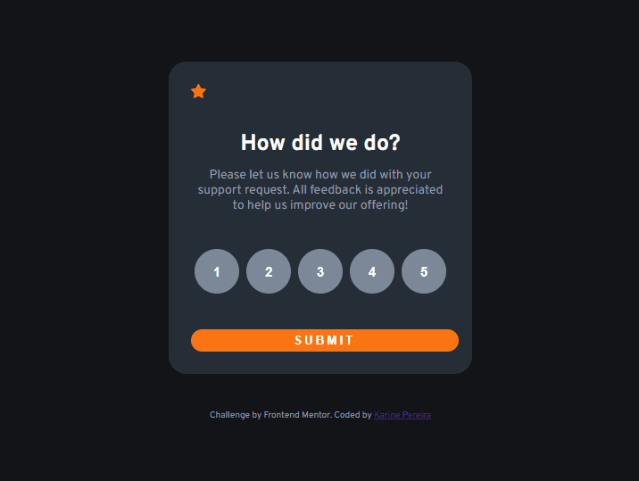

# 🖥️ "Interactive Rating Component"  

## 📜 Descrição
Projeto realizado com o objetivo de criar uma tela, onde a pessoa possa escolher uma nota para determinado serviço. 

## ✍️ Processo
- Marcação semântica HTML5
- Propriedades personalizadas de CSS3
- JavaScript
- Flexbox  
- Design responsivo

## ⌨ Funcionalidades

- Clicando na nota e depois no botão de enviar, vai aparecer uma tela agradecendo a nota e informando qual nota foi dada pelo usuário.
    
## 🖱️ A página
    

> <a href="https://devkarine.github.io/interactive-rating-component/" target= "_blank">Acesse a página online</a>  

## 👩‍💻 Dev
<table align="center">
  <tr>
    <td align="center">
      

         
          <b> Karine Pereira </b> 
            
            
      

    </td>

  </tr>
</table>
